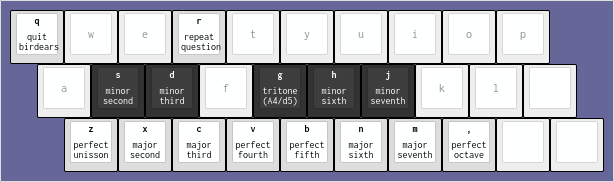
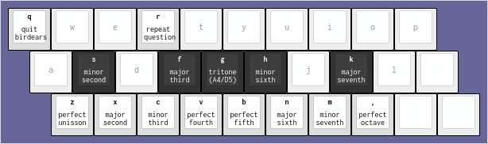
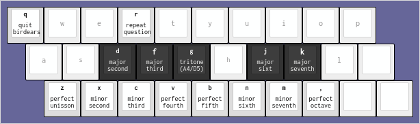
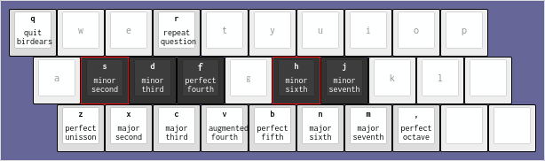
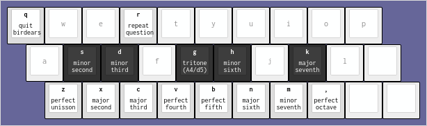
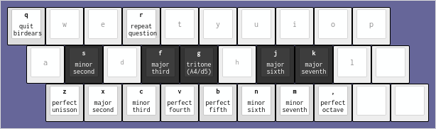
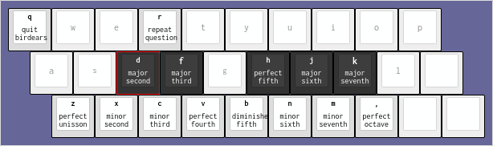
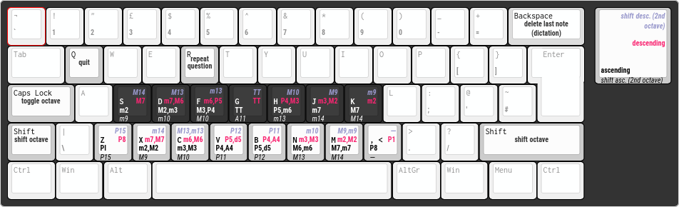

birdears
========

`Maintenance <https://github.com/iacchus/birdears/issues/new?title=Is+birdears+still+maintained&body=Please+file+an+issue+if+the+maintained+button+says+no>`__
`Travis Build Status <https://travis-ci.org/iacchus/birdears>`__
`Coveralls <https://coveralls.io/github/iacchus/birdears>`__ `Awesome
Sheet Music <https://iacchus.github.io/awesome-sheet-music/>`__

`GitHub (pre-)release <https://github.com/iacchus/birdears/releases>`__
`PyPI Status <https://pypi.python.org/pypi/birdears>`__ `PyPI
Version <https://pypi.python.org/pypi/birdears>`__ `PyPI Python
Versions <https://pypi.python.org/pypi/birdears>`__ `Documentation
Status <https://birdears.readthedocs.io/en/latest/>`__

.. raw:: html

   <!-- TOC depthFrom:2 depthTo:6 withLinks:1 updateOnSave:1 orderedList:0 -->

-  `Introduction <#introduction>`__

   -  `birdears <#birdears>`__
   -  `What is musical ear training <#what-is-musical-ear-training>`__
   -  `Features <#features>`__

-  `Installing <#installing>`__

   -  `Installing the dependencies <#installing-the-dependencies>`__

      -  `Arch Linux <#arch-linux>`__

   -  `Installing birdears <#installing-birdears>`__

      -  `In-depth installation <#in-depth-installation>`__

-  `Running <#running>`__
-  `Keybindings <#keybindings>`__
-  `Documentation <#documentation>`__
-  `Contributing <#contributing>`__

.. raw:: html

   <!-- /TOC -->

For the support chat, please ``/join``
```#birdears`` <https://webchat.freenode.net/?randomnick=1&channels=%23birdears&uio=MTY9dHJ1ZSYxMT0yNDY57>`__
channel on freenode (``chat.freenode.net/6697`` - ssl).

.. figure:: use.gif
   :alt: birdears screencast

   birdears screencast

Introduction
------------

.. _birdears-1:

birdears
~~~~~~~~

``birdears`` is a software written in Python 3 for ear training for
musicians (musical intelligence, transcribing music, composing). It is a
clone of the method used by `Funcitional Ear
Trainer <https://play.google.com/store/apps/details?id=com.kaizen9.fet.android>`__
app for Android.

It comes with four modes, or four kind of exercises, which are:
``melodic``, ``harmonic``, ``dictation`` and ``instrumental``.

In resume, with the *melodic* mode two notes are played one after the
other and you have to guess the interval; with the ``harmonic`` mode,
two notes are played simoutaneously (harmonically) and you should guess
the interval.

With the *dictation* mode, more than 2 notes are played (*ie*., a
melodic dictation) and you should tell what are the intervals between
them.

With the *instrumental* mode, it is a like the *dictation*, but you will
be expected to play the notes on your instrument, *ie*., birdears will
not wait for a typed reply and you should prectice with your own
judgement. The melody can be repeat any times and you can have as much
time as you want to try it out.

What is musical ear training
~~~~~~~~~~~~~~~~~~~~~~~~~~~~

*this needs to be written. The method.*

Features
~~~~~~~~

-  questions
-  pretty much configurable
-  load from config file
-  you can make your own presets
-  can be used interactively *(docs needed)*
-  can be used as a library *(docs needed)*

Installing
----------

Installing the dependencies
~~~~~~~~~~~~~~~~~~~~~~~~~~~

``birdears`` depends only on ``python >= 3.5`` and ``sox`` (which should
be installed by your distribution’s package manager, supposing you’re
using linux, and which provides the ``play`` command.)

Arch Linux
^^^^^^^^^^

::

   sudo pacman -Syu sox python python-pip

Installing birdears
~~~~~~~~~~~~~~~~~~~

``pip3 install --user --upgrade --no-cache-dir birdears``

In-depth installation
^^^^^^^^^^^^^^^^^^^^^

You can choose to use a virtualenv to use birdears; this should give you
an idea on how to setup one virtualenv.

You should first install virtualenv (for python3) using your
distribution’s package (supposing you’re on linux), then on terminal:

::

   virtualenv -p python3 ~/.venv # use the directory ~/.venv/ for the virtualenv

   source ~/.venv/bin/activate   # activate the virtualenv; this should be done
                                 # every time you may want to run the software
                                 # installed here.

   pip3 install birdears         # this will install the software

   birdears --help               # and this will run it

Running
-------

After installing just run:

``birdears --help``

Keybindings
-----------

The following keyboard diagrams should give you an idea on how the
keybindings work. Please note how the keys on the line from ``z``
(*unison*) to ``,`` (comma, *octave*) represent the notes that are
*natural* to the mode, and the line above represent the chromatics.

Also, for exercises with two octaves, the **uppercased keys represent
the second octave**. For example, ``z`` is *unison*, ``,`` is the
*octave*, ``Z`` (uppercased) is the *double octave*. The same for all
the other intervals.

Ionian (Major)
~~~~~~~~~~~~~~

These are the keybindings for the **Ionian (Major) Scale**; black keys
are the chromatic notes.



   birdears - ionian(major) keybindings

Dorian
~~~~~~



   birdears - dorian keybindings

Phrygian
~~~~~~~~



   birdears - phryigian keybindings

Lydian
~~~~~~



   birdears - lydian keybindings

Mixolydian
~~~~~~~~~~



   birdears - mixolydian keybindings

Aeolian (minor)
~~~~~~~~~~~~~~~



   birdears - aeolian keybindings

Locrian
~~~~~~~



   birdears - locrian(minor) keybindings

Advanced
--------



   birdears - advanced keybindings

*this is still being improved*

Legend for the keys on the diagram above:

+--------------------+-----------------+------------------------------------+
| Text Format        | Scale Direction | Octave                             |
+====================+=================+====================================+
| blue (bold italic) | descending      | second octave (shift or caps lock) |
+--------------------+-----------------+------------------------------------+
| pink (bold)        | descending      | first octave                       |
+--------------------+-----------------+------------------------------------+
| black/white (bold) | ascending       | first octave                       |
+--------------------+-----------------+------------------------------------+
| black (italic)     | ascending       | second octave (shift or caps lock) |
+--------------------+-----------------+------------------------------------+

**White keys** are the diatonic notes, **black keys** are the chromatic
ones.

Descendent mode are usable for exercises with ``-d`` or
``--descendent``.

Chromatic keys are usable for exercises with ``-c`` or ``--chromatic``.

Second octave is usable for exercises with ``-n 2`` or ``--n_octaves 2``

Documentation
-------------

Full documentation for this software is available at birdears `Read The
Docs <https://birdears.readthedocs.io/en/latest/>`__ and also in `PDF
format <https://github.com/iacchus/birdears/raw/master/docs/sphinx/_build/latex/birdears.pdf>`__.

Contributing
------------

Those who want to contribute to this project can read
`CONTRIBUTING.md <CONTRIBUTING.md>`__.

Etc
---

the screencast was recorded with a command similar to

::

   COLUMNS=120 LINES=36 ttyrec
   seq2gif -s 2 -i ttyrecord -w 120 -h 36 -o use.gif

`ttyrec <https://aur.archlinux.org/packages/ttyrec/>`__ and
`seq2gif <https://github.com/saitoha/seq2gif>`__

keyboard layouts were generated with
http://www.keyboard-layout-editor.com/
